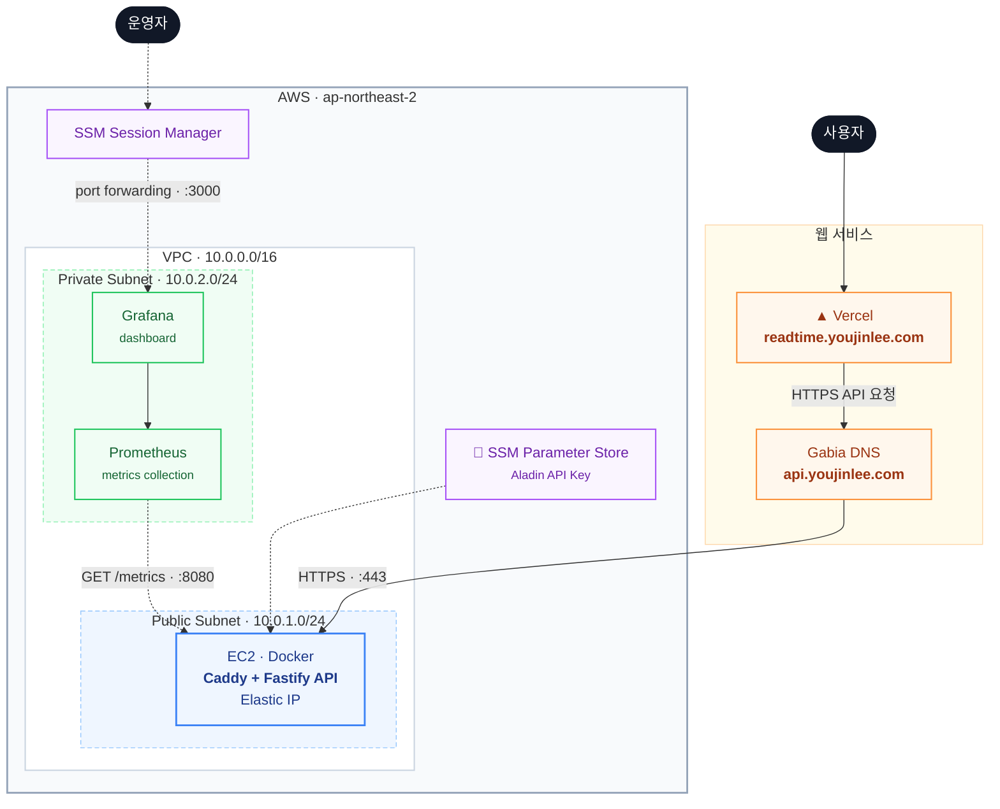

# Readtime

개인의 읽기 속도와 책 정보를 바탕으로 예상 완독 시간을 계산하는 서비스입니다.
짧은 장르별 글로 읽기 속도를 측정하고, 알라딘 OpenAPI에서 가져온 도서의
페이지 수와 카테고리를 함께 반영해 예상 시간과 범위를 보여줍니다.

## 서비스 기능

- 장르별 예시 글을 활용한 개인 읽기 속도 측정
- 알라딘 OpenAPI 기반 도서 검색, 베스트셀러 및 상세 정보 조회
- 페이지 수, 도서 카테고리, 읽기 속도를 반영한 완독 시간 예측
- 선택한 책과 비슷한 도서 추천
- 페이지 정보가 없거나 그림 비중이 높은 도서의 측정 제한 안내

## 인프라 설계

프론트엔드는 Vercel에서 제공하고, 백엔드는 AWS 퍼블릭 서브넷의 EC2에서 Docker
컨테이너로 실행합니다. Caddy가 HTTPS 인증서와 리버스 프록시를 담당하며 서비스
EC2에는 Elastic IP를 연결해 고정된 API 주소를 유지합니다.

Prometheus와 Grafana는 별도의 프라이빗 EC2에서 실행합니다. Prometheus는
Fastify의 요청 수와 응답 시간, 프로세스 지표를 수집하고 Grafana는 SSM 포트
포워딩을 통해서만 접근할 수 있습니다. 알라딘 API 키는 SSM Parameter Store의
SecureString으로 관리합니다.

AWS 네트워크, 보안 그룹, IAM, EC2 및 관측 환경은 Terraform으로 관리합니다.

## 기술 구성

| 영역 | 기술 |
| --- | --- |
| Frontend | Next.js, TypeScript, Vercel |
| Backend | Node.js, Fastify, Docker |
| Book data | Aladin OpenAPI |
| Infrastructure | AWS VPC, EC2, Elastic IP, SSM, Terraform |
| Observability | Prometheus, Grafana |
